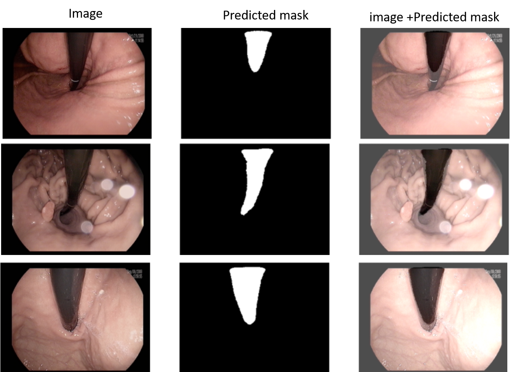

# Segmentation: Kvasir Instrument Dataset
## Endoscopy instrument detection
Here is the kaggle notebook: https://www.kaggle.com/sumitai/segmentation-unet/notebook
### Libraries:
-----------------------------------------------------------------
``` python 
pip install gradio
pip install tensorflow 
pip install keras 
pip install matplotlib 
pip install pandas # numpy will be installed autimaticallly 


import numpy 
import tensorflow 
import keras
import matplotlib.pyplot as plt
import glob 
import keras 

```

### Models used: 
In this work I used UNet segmentation. 

### Results:
``` python
Train DSC: 0.831
Test DSC: 0.767
Validation DSC: 0.767
```

